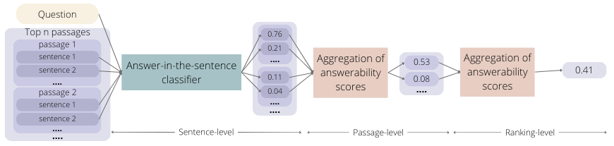

# Towards Reliable and Factual Response Generation: Detecting Unanswerable Questions in Information-seeking Conversations

## Summary

Generative AI models face the challenge of hallucinations that can undermine users' trust in such systems. We propose to approach the problem of conversational information seeking as a two-step process, where relevant passages in a corpus are identified first and then summarized into a final system response. This way we can automatically assess if the answer to the user's question is present in the corpus. Specifically, our proposed method employs a sentence-level classifier to detect if the answer is present, then aggregates these predictions on the passage level, and eventually across the top-ranked passages to arrive at a final answerability estimate. For training and evaluation, we develop a dataset based on the TREC CAsT benchmark that includes answerability labels on the sentence, passage, and ranking levels. We demonstrate that our proposed method represents a strong baseline and outperforms a state-of-the-art LLM on the answerability prediction task. 

## Answerability Detection

The challenge of answerability in conversational information seeking arises from the fact that the answer is typically not confined to a single entity or text snippet, but rather spans across multiple sentences or even multiple paragraphs. Note that answerability extends beyond the general notion of relevance and asks for the presence of a specific answer. 

At the core of our approach is a sentence-level classifier (more details [here](/answerability_prediction/sentence_classification/README.md)) that can distinguish sentences that contribute to the answer from ones that do not. These sentence-level estimates are then aggregated on the passage level and then further on the ranking level (i.e., set of top-n passages) (more details [here](/answerability_prediction/answerability_aggregation/README.md)) to determine whether the question is answerable. 

## Data

The data used for answer-in-the-sentence classifier training and evaluation, as well as for evaluation of passage- and ranking-level answerability scores aggregation is covered in detail [here](/data/README.md).