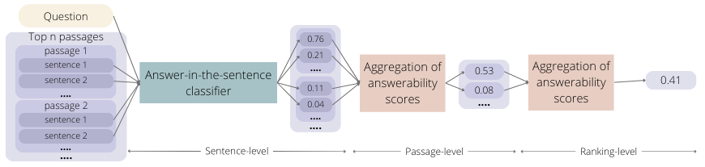

# Answerability Detection

The challenge of answerability in conversational information seeking arises from the fact that the answer is typically not confined to a single entity or text snippet, but rather spans across multiple sentences or even multiple paragraphs. Note that answerability extends beyond the general notion of relevance and asks for the presence of a specific answer. 

At the core of our approach is a sentence-level classifier (more details [here](sentence_classification/README.md)) that can distinguish sentences that contribute to the answer from ones that do not. These sentence-level estimates are then aggregated on the passage level and then further on the ranking level (i.e., set of top-n passages) (more details [here](answerability_aggregation/README.md)) to determine whether the question is answerable. 

